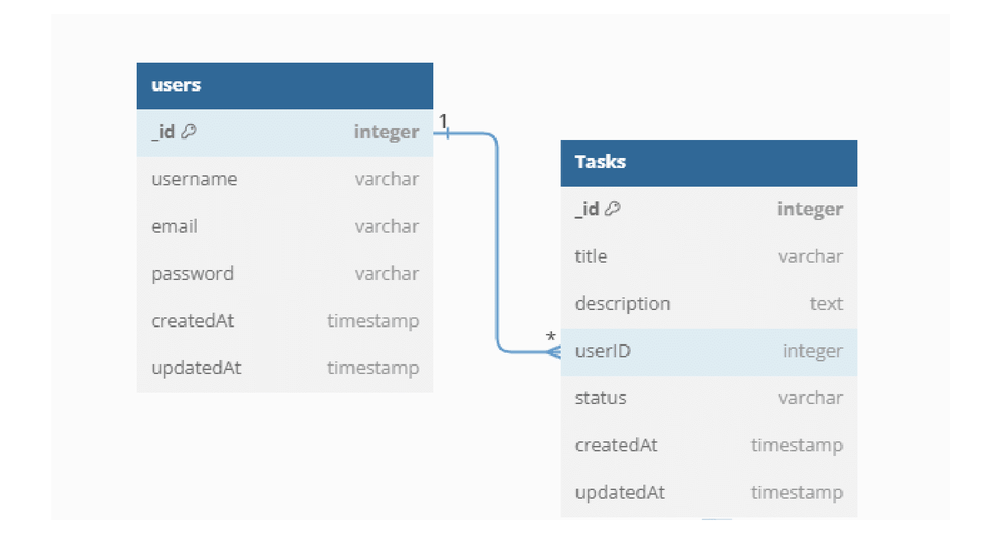
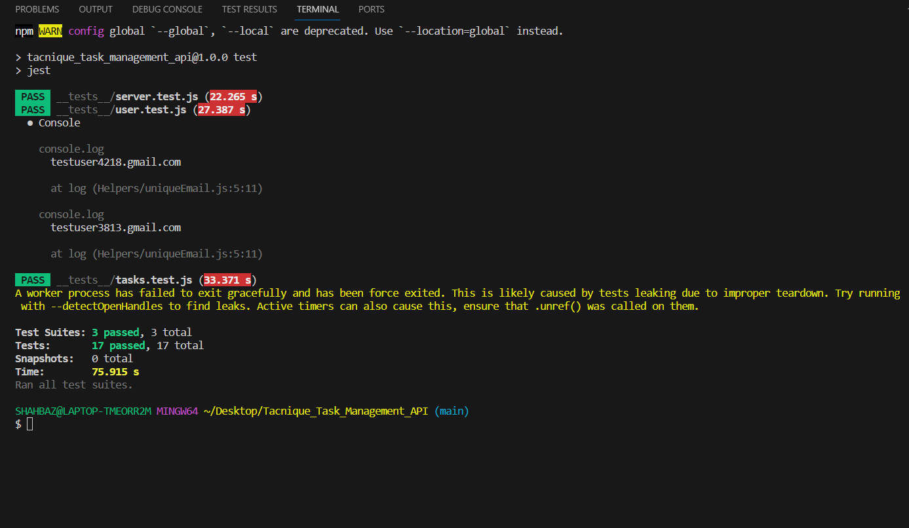
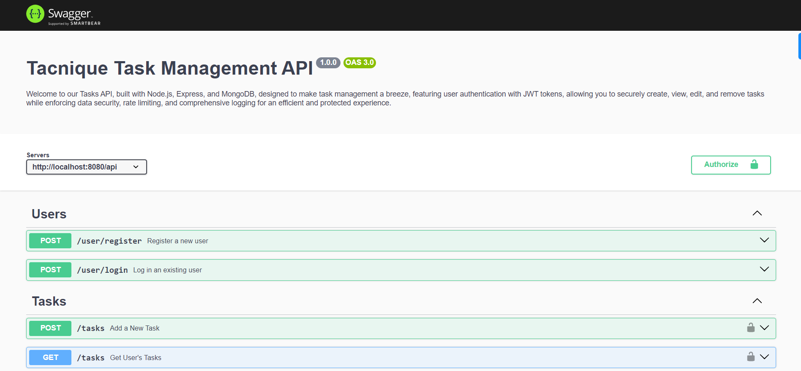
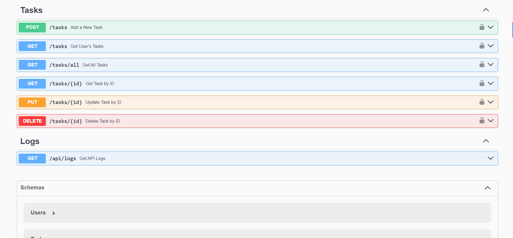
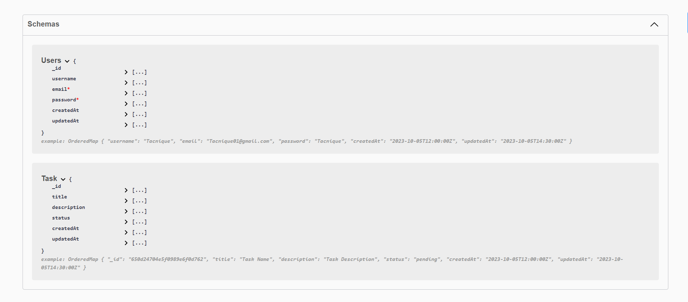

# Tacnique Task Management API

Welcome to the Tacnique Task Management API! This API is built using Node.js and Express,MongoDB, featuring advanced functionalities such as rate limiting and logging powered by Winston. It's designed to help you manage your tasks efficiently.

## Table of Contents

- [Getting Started](#getting-started)
- [Installation](#installation)
- [Usage](#usage)
- [API Endpoints](#api-endpoints)
- [Authentication](#authentication)
- [Deployment](#deployment)
- [Entity Relation Diagram](#entity-relation-diagram)
- [Snapshots](#Snapshots)

## Getting Started

Before using the Task Management API, make sure you have Node.js and MongoDB installed on your system.

## Installation

To set up the project locally, follow these steps:

1. Clone the repository:

```bash
# Clone the repository
git clone https://github.com/shaikhshahbaz4022/Tacnique_Task_Management_API.git

# Navigate to the project directory
cd Tacnique_Task_Management_API

# Install dependencies
npm install

# Start the Server
npm run server

```

## Deployment

You can access the live demo of the Tacnique Task Management API by [clicking here](https://task-management-api-cjuu.onrender.com/). Explore the API's features and functionalities in action!

## Authentication

Certain endpoints in this API require authentication to ensure security. To obtain access to these endpoints, you need to obtain a JSON Web Token (JWT) by logging in. Once you have the token, include it in the `Authorization` header of your requests to access authenticated endpoints.

## Rate Limiting

To ensure fair usage and prevent abuse, this API implements rate limiting. You can make up to 10 requests per minute, safeguarding the system from excessive traffic.

## Logging

Logging is an integral part of this API, powered by Winston. Every interaction with the API is meticulously tracked and logged. This feature serves as a valuable tool for monitoring and troubleshooting purposes.

## API Endpoints

Explore the powerful API endpoints available in this project:

| No. | API Endpoint        | Feature           | Description                                                             |
| --- | ------------------- | ----------------- | ----------------------------------------------------------------------- |
| 1   | POST /user/register | User Registration | Create a new user account.                                              |
| 2   | POST /user/login    | User Login        | Log in with your credentials.                                           |
| 3   | POST /user/logout   | User Logout       | Safely log out from your account.                                       |
| 4   | POST /tasks         | Create Task       | Add a new task to your list.                                            |
| 5   | GET /tasks          | Get User's Tasks  | Retrieve tasks associated with your account.                            |
| 6   | GET /tasks/all      | Get All Tasks     | Fetch all tasks across the platform. (Rate limiting: 10 req per minute) |
| 7   | GET /tasks/:id      | Get Task by ID    | Find a specific task using its unique ID.                               |
| 8   | PUT /tasks/:id      | Update Task       | Modify the details of a task.                                           |
| 9   | DELETE /tasks/:id   | Delete Task       | Remove a task from your list.                                           |
| 10  | GET /logs           | Get All Logs      | All Logs Related to API Fetched.                                        |

## Entity Relation Diagram



## TestCases Using Jest And Supertest

```bash
Test-Driven Development (TDD) using Jest and SuperTest was employed, where tests were written before writing the actual code, ensuring a robust and comprehensively tested codebase.

# Run the test cases After Clone

npm test

# to detect Any Errors

npm run detect

```



## Snapshots




